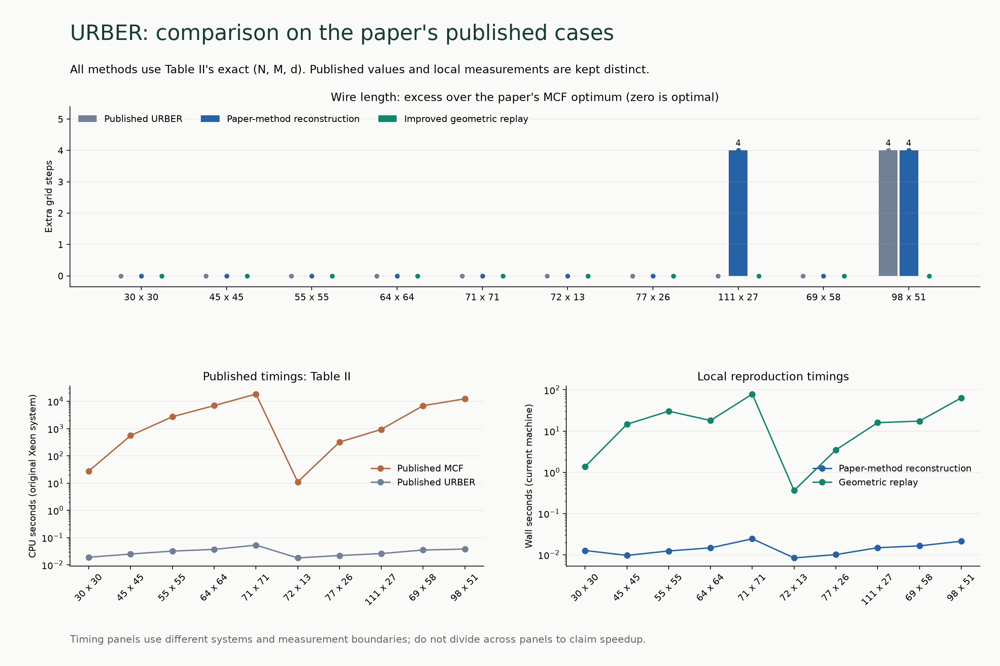
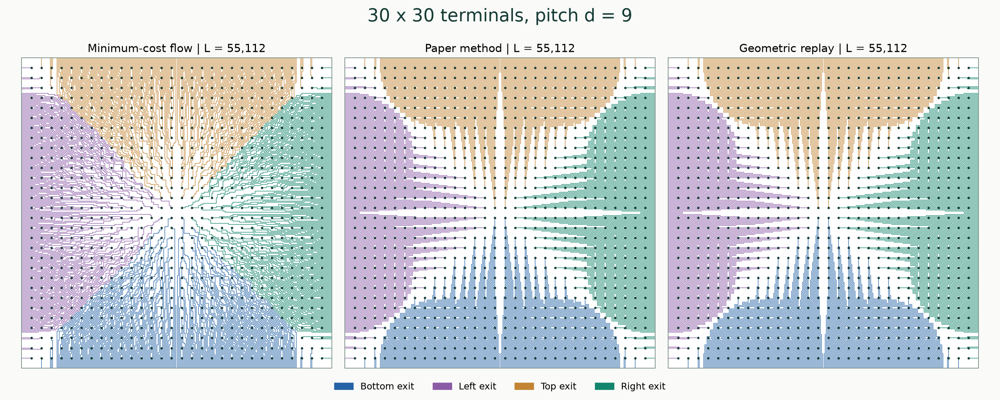
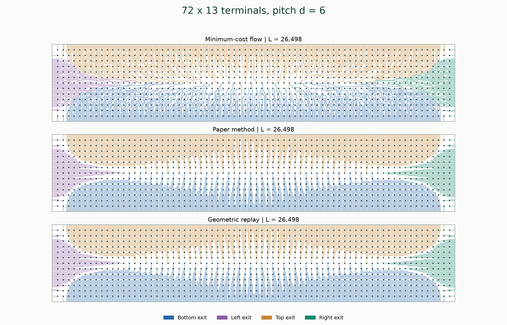
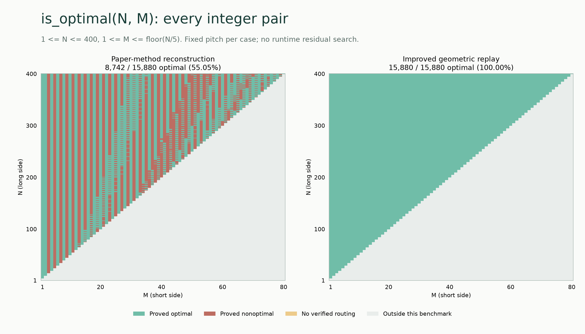

# URBER

Code for **URBER: Ultrafast Rule-Based Escape Routing Method for Large-Scale Sample Delivery Biochips**, by Jiayi Weng, Tsung-Yi Ho, Weiqing Ji, Peng Liu, Mengdi Bao, and Hailong Yao. [Paper](https://trinkle23897.github.io/pdf/URBER.pdf) · [DOI](https://doi.org/10.1109/TCAD.2018.2883908)

This repository provides an independent reconstruction of the paper's method, a minimum-cost-flow reference solver, and an improved geometric routing method. It is not a recovered copy of the original authors' implementation.

## Results reported in the paper

- **Table II:** ten fixed-pitch benchmarks with 900–5,041 terminals. URBER matches the MCF optimum on nine; for `98 x 51, d=20`, it reports **1,399,338** versus the optimum **1,399,334**. Published URBER times are **0.018–0.053 seconds**, compared with **11.03–18,402.45 seconds** for MCF.
- **Section IV / Figure 17:** all **5,041** integer pairs with `30 <= N,M <= 100` were tested. The paper reports approximately **91.9% optimal solutions**, approximately 408 suboptimal cases, and a maximum excess length of 20. It reports optimality throughout `3/4 < M/N < 4/3`.
- **Table III:** ten larger cases with 99,856–500,123 terminals, published runtimes of **7.50–256.54 seconds**, and memory below **4.2 GB**.

These are the paper's results, measured using one thread on an Intel Xeon E5620 2.40 GHz Linux server. The transcribed [Table II](benchmarks/paper/table_ii.csv), [Table III](benchmarks/paper/table_iii.csv), and [source metadata](benchmarks/paper/source.json) preserve the published values. They are distinct from measurements of this reconstruction.

## Direct comparison on the published benchmarks

Every entry below uses the exact `(N, M, d)` from **Table II**. `L*` is the optimum reported for the paper's MCF baseline.

| N x M | d | Published MCF L* | Published URBER L | Paper-method reconstruction L | Improved geometric L |
|---|---:|---:|---:|---:|---:|
| 30 x 30 | 9 | 55,112 | 55,112 | 55,112 | 55,112 |
| 45 x 45 | 14 | 273,183 | 273,183 | 273,183 | 273,183 |
| 55 x 55 | 17 | 602,856 | 602,856 | 602,856 | 602,856 |
| 64 x 64 | 19 | 1,092,600 | 1,092,600 | 1,092,600 | 1,092,600 |
| 71 x 71 | 22 | 1,657,902 | 1,657,902 | 1,657,902 | 1,657,902 |
| 72 x 13 | 6 | 26,498 | 26,498 | 26,498 | 26,498 |
| 77 x 26 | 11 | 183,686 | 183,686 | 183,686 | 183,686 |
| 111 x 27 | 12 | 326,743 | 326,743 | 326,747 | 326,743 |
| 69 x 58 | 19 | 1,034,338 | 1,034,338 | 1,034,338 | 1,034,338 |
| 98 x 51 | 20 | 1,399,334 | 1,399,338 | 1,399,338 | 1,399,334 |

The paper-method reconstruction matches nine of the ten published URBER lengths. Its `111 x 27` result is four units longer than the published value; that reconstruction discrepancy is kept visible. The improved geometric method matches the published MCF optimum on all ten cases, including both `111 x 27` and `98 x 51`.



The timing panels deliberately separate **published CPU times** from **local end-to-end measurements**. Different hardware, implementations, and measurement boundaries prevent a direct cross-panel speedup claim. The geometric method improves solution quality but can be substantially slower than the original rules. [Measured data](benchmarks/paper/reproduced_ii.jsonl) · [Measurement environment](benchmarks/paper/reproduction_environment.json)

<details>
<summary>Table III: published large-scale results and reconstructed lengths</summary>

| N x M | d | Published URBER L | Reconstruction L | Published CPU (s) | Published memory (M) |
|---|---:|---:|---:|---:|---:|
| 316 x 316 | 93 | 629,985,640 | 629,985,640 | 7.50 | 348.8 |
| 447 x 447 | 132 | 2,517,494,576 | 2,517,494,576 | 42.42 | 964.5 |
| 548 x 548 | 161 | 5,679,142,936 | 5,679,142,936 | 65.10 | 1749 |
| 632 x 632 | 186 | 10,042,278,616 | 10,042,278,616 | 114.49 | 2861 |
| 707 x 707 | 208 | 15,720,245,427 | 15,720,245,427 | 256.54 | 4155 |
| 375 x 267 | 92 | 608,817,645 | 608,817,645 | 8.94 | 341.8 |
| 532 x 376 | 129 | 2,420,475,700 | 2,420,475,700 | 24.73 | 946.5 |
| 858 x 350 | 141 | 4,385,731,204 | 4,385,731,204 | 38.23 | 1532 |
| 904 x 442 | 171 | 8,477,760,224 | 8,477,760,224 | 76.60 | 2572 |
| 949 x 527 | 196 | 14,012,963,087 | 14,012,963,087 | 189.95 | 3868 |

All ten reconstructed lengths match the published Table III values. These reconstruction measurements are archived runs of the same C++ source. The improved geometric portfolio and MCF are not claimed to have been rerun on these large cases. [Reconstruction data](benchmarks/paper/reproduced_iii.jsonl)

</details>

## Routing examples

The figures below show actual exported paths. Colors identify the exit side; dots are terminals. All three methods use the same pitch and attain the same optimal length in these two examples. The different geometry illustrates the regular structure of rule-based routing.

**Table II, 30 x 30, d=9 — L=55,112**



**Table II, 72 x 13, d=6 — L=26,498**



## Optimality map

This additional stress test compares the **paper-method reconstruction directly with the improved geometric method**, using identical recorded pitches on every integer pair in `1 <= N <= 400, 1 <= M <= floor(N/5)`. It is a different domain from the paper's Figure 17; its percentages must not be compared with the paper's 91.9% as if the test sets were identical.



Green means a geometrically verified routing reaches an independent lower bound. Red means a shorter verified routing exists. Yellow means the construction did not return a verified routing. The improved method reaches the bound on all **15,880** points in this completed thin-rectangle test. [Data and methodology](docs/benchmark.md)

A separate parallel sweep of **all 160,000 ordered pairs `1 <= N,M <= 400`** is supported by `research.full_sweep`. Its results are not substituted for the completed map above before the full run finishes.

## Build

Requires GCC or Clang with C++17 support, Make, and Python 3.11 or later. The paper and geometric routers need no external solver. Install the research dependencies for MCF, tests, and figures:

```sh
make -j4
python3 -m venv .venv
.venv/bin/python -m pip install -r requirements.txt
mkdir -p results/routes
```

## Reproduce the three methods

The following commands all solve the paper's `30 x 30, d=9` example and export their actual paths:

```sh
# 1. Exact minimum-cost flow on the vertex-capacitated fine grid.
.venv/bin/python -m research.experiment mcf 30 30 9 \
  --output results/routes/mcf-30x30-d9.json

# 2. Reconstruction of the paper's original rule-based method.
./build/urber 30 30 9 results/routes/paper-30x30-d9.json

# 3. Improved geometric method, without a runtime flow solver.
.venv/bin/python route.py 30 30 9 results/routes/geometric-30x30-d9.json
```

Reproduce the published benchmark tables:

```sh
# Paper method and improved method: every case in Table II.
.venv/bin/python -m research.paper --table ii --methods paper geometric

# Exact MCF: every case in Table II. This can be expensive.
.venv/bin/python -m research.paper --table ii --methods mcf

# Paper method: every large-scale case in Table III.
.venv/bin/python -m research.paper --table iii --methods paper

# Run every ordered pair in the full 1..400 square in parallel.
.venv/bin/python -m research.full_sweep --max-n 400 --workers 32 \
  --output results/full-400
```

Table runners accept `--case N M`, `--paths-dir DIR`, `--output FILE`, and `--resume`. The full sweep saves per-case results, progress, and a completion marker; it can be resumed with the same command plus `--resume`. [Detailed reproduction and figure commands](docs/reproduction.md)

```sh
make test PYTHON=.venv/bin/python
make plot PYTHON=.venv/bin/python
```

## Method and guarantees

The improved method uses an explicit optimal fan at high pitch and a fixed portfolio of bounded geometric replays otherwise. It retains successful later routing decisions when changing earlier ones, with selected equal-length moves. It does not read benchmark answers or call MCF at runtime. Its additional replay work is `O(G)`, where `G=((N+1)d+1)((M+1)d+1)`; this is not a proof of strict `O(NM)` with variable pitch or of optimality for arbitrary inputs.

For low-pitch inputs, `optimality_certified: false` means no certificate was computed online. Offline equality with an independent lower bound proves optimality for the measured instance. The high-pitch branch has a general proof.

- [Routing model and geometric replay](docs/algorithm.md)
- [Legality, complexity, and optimality evidence](docs/guarantees.md)
- [High-pitch fan proof](docs/fan-proof.md)

`src/` contains the C++ implementations and independent geometry verifier; `research/` contains offline solvers, benchmark runners, and plotting tools; `benchmarks/` contains published and measured data. The historical `build/urber --polish` residual-search extension remains available for research, but is not the geometric method compared above. Generated binaries and new runs go into ignored `build/` and `results/` directories.
