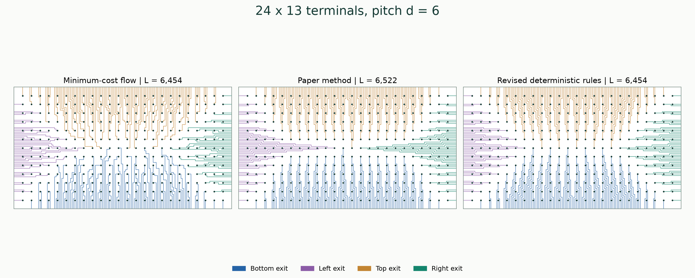
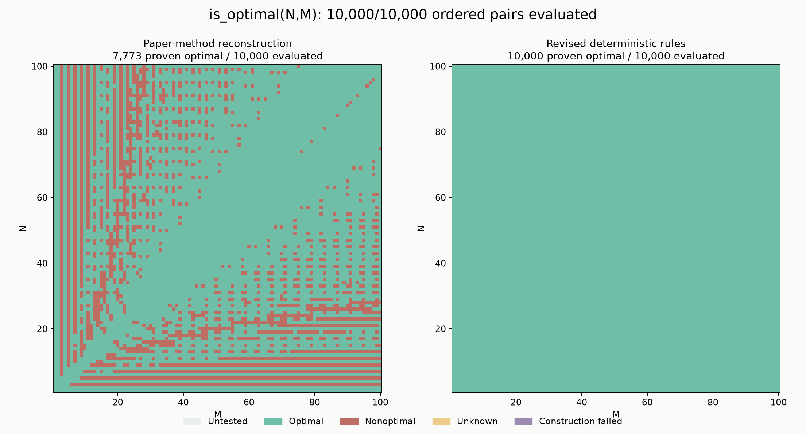
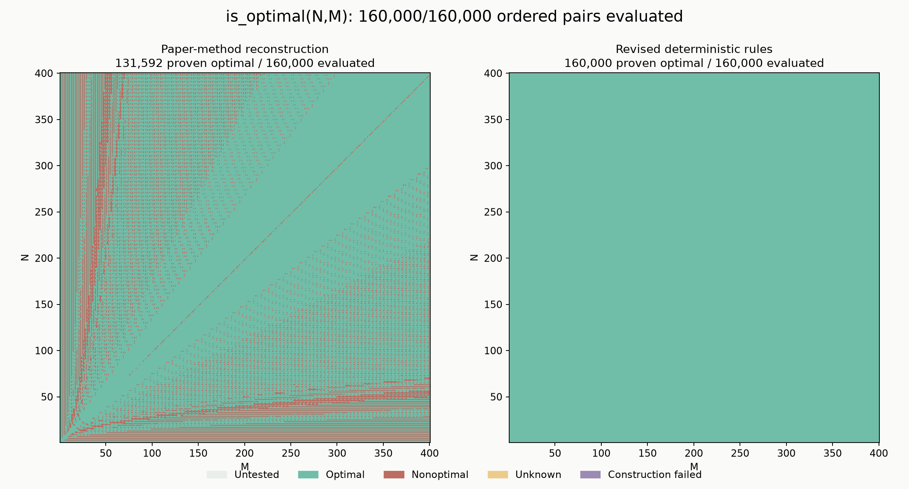

# URBER

Code for **URBER: Ultrafast Rule-Based Escape Routing Method for Large-Scale Sample Delivery Biochips**, by Jiayi Weng, Tsung-Yi Ho, Weiqing Ji, Peng Liu, Mengdi Bao, and Hailong Yao. [Paper](https://trinkle23897.github.io/pdf/URBER.pdf) · [DOI](https://doi.org/10.1109/TCAD.2018.2883908)

This repository provides an independent reconstruction of the paper's method, a minimum-cost-flow reference solver, and a deterministic single-construction router. It is not a recovered copy of the original authors' implementation.

## Results reported in the paper

- **Table II:** ten fixed-pitch benchmarks with 900–5,041 terminals. URBER matches the MCF optimum on nine; for `98 x 51, d=20`, it reports **1,399,338** versus the optimum **1,399,334**. Published URBER times are **0.018–0.053 seconds**, compared with **11.03–18,402.45 seconds** for MCF.
- **Section IV / Figure 17:** all **5,041** integer pairs with `30 <= N,M <= 100` were tested. The paper reports approximately **91.9% optimal solutions**, approximately 408 suboptimal cases, and a maximum excess length of 20. It reports optimality throughout `3/4 < M/N < 4/3`.
- **Table III:** ten larger cases with 99,856–500,123 terminals, published runtimes of **7.50–256.54 seconds**, and memory below **4.2 GB**.

These are the paper's results, measured using one thread on an Intel Xeon E5620 2.40 GHz Linux server. The transcribed [Table II](benchmarks/paper/table_ii.csv), [Table III](benchmarks/paper/table_iii.csv), and [source metadata](benchmarks/paper/source.json) preserve the published values. They are distinct from measurements of this reconstruction.

## Direct comparison on the published benchmarks

**The revised deterministic rules match the published MCF optimum on all ten Table II cases.** Each case uses one construction at the supplied pitch. The router chooses the proved fan at high pitch, preserves the canonical original construction on dense grids, and changes central fan assignment and boundary choices in the remaining regime. It does not replay paths, retry parameters, or call a solver online.

Every entry below uses the exact `(N, M, d)` from **Table II**. `L*` is the optimum reported for the paper's MCF baseline.

| N x M | d | Published MCF L* | Published URBER L | Paper-method reconstruction L | Revised rules L |
|---|---:|---:|---:|---:|---:|
| 30 x 30 | 9 | 55,112 | 55,112 | 55,112 | 55,112 |
| 45 x 45 | 14 | 273,183 | 273,183 | 273,183 | 273,183 |
| 55 x 55 | 17 | 602,856 | 602,856 | 602,856 | 602,856 |
| 64 x 64 | 19 | 1,092,600 | 1,092,600 | 1,092,600 | 1,092,600 |
| 71 x 71 | 22 | 1,657,902 | 1,657,902 | 1,657,902 | 1,657,902 |
| 72 x 13 | 6 | 26,498 | 26,498 | 26,498 | 26,498 |
| 77 x 26 | 11 | 183,686 | 183,686 | 183,686 | 183,686 |
| 111 x 27 | 12 | 326,743 | 326,743 | 326,747 | 326,743 |
| 69 x 58 | 19 | 1,034,338 | 1,034,338 | 1,034,338 | 1,034,338 |
| 98 x 51 | 20 | 1,399,334 | 1,399,338 | 1,399,338 | 1,399,334 |

The paper-method reconstruction matches nine of the ten published URBER lengths. Its `111 x 27` result is four units longer than the published value; that reconstruction discrepancy is kept visible. The revised rules match the published MCF optimum on all ten cases, including both `111 x 27` and `98 x 51`.


The timing panels separate **published CPU times** from **devbox wall times**, which include startup and geometry verification. The measured methods ran serially within their job while other validation jobs were active. Different hardware and measurement boundaries prevent a cross-panel speedup claim. [Measured data](benchmarks/paper/revised_ii.jsonl) · [Environment and source hashes](benchmarks/paper/revised_environment.json)

<details>
<summary>Table III: published large-scale results and reconstructed lengths</summary>

| N x M | d | Published URBER L | Reconstruction L | Published CPU (s) | Published memory (M) |
|---|---:|---:|---:|---:|---:|
| 316 x 316 | 93 | 629,985,640 | 629,985,640 | 7.50 | 348.8 |
| 447 x 447 | 132 | 2,517,494,576 | 2,517,494,576 | 42.42 | 964.5 |
| 548 x 548 | 161 | 5,679,142,936 | 5,679,142,936 | 65.10 | 1749 |
| 632 x 632 | 186 | 10,042,278,616 | 10,042,278,616 | 114.49 | 2861 |
| 707 x 707 | 208 | 15,720,245,427 | 15,720,245,427 | 256.54 | 4155 |
| 375 x 267 | 92 | 608,817,645 | 608,817,645 | 8.94 | 341.8 |
| 532 x 376 | 129 | 2,420,475,700 | 2,420,475,700 | 24.73 | 946.5 |
| 858 x 350 | 141 | 4,385,731,204 | 4,385,731,204 | 38.23 | 1532 |
| 904 x 442 | 171 | 8,477,760,224 | 8,477,760,224 | 76.60 | 2572 |
| 949 x 527 | 196 | 14,012,963,087 | 14,012,963,087 | 189.95 | 3868 |

All ten reconstructed lengths match the published Table III values. These reconstruction measurements are archived runs of the original-rule reconstruction. The revised rules and MCF are not claimed to have been rerun on these large cases. [Reconstruction data](benchmarks/paper/reproduced_iii.jsonl)

</details>

## Routing examples

The figures below show actual exported paths. Colors identify the exit side; dots are terminals. All three methods use the same pitch and attain the same optimal length in these two examples. The different geometry illustrates the regular structure of rule-based routing.

**Table II, 30 x 30, d=9 — L=55,112**


**Table II, 72 x 13, d=6 — L=26,498**


**A repaired counterexample, 24 x 13, d=6 — 6,522 → 6,454**

The revised central fan rule reaches the independently computed MCF optimum in one construction.



## Comparison with Figure 17

All **5,041** ordered pairs in the paper's `30 <= N,M <= 100` dimension range attain the independent lower bound under the revised rules.

| Method / experiment | Proven optimal in the 5,041-case range |
|---|---:|
| Original paper, reported result | Approximately 91.9% |
| Paper-method reconstruction at the recorded pitches | 4,621 / 5,041 = 91.67% |
| Revised deterministic rules at the same pitches | **5,041 / 5,041 = 100%** |

The last two rows use identical recorded pitches. They reproduce the paper's dimension range, but not its complete pitch selection: existing benchmark pitches are retained and the other pitches come from the reconstructed paper method's bisection. Table II above uses the paper's exact pitches.

The expanded scan of **every `1 <= N,M <= 100`** reaches **10,000 / 10,000 (100%)** proven optima. Every construction passes independent geometry verification and matches the fixed-pitch boundary-assignment lower bound.



Green means equality with a valid lower bound; red means a shorter verified routing is known. Every revised-rule result in this map is green.

[Per-case CSV](benchmarks/rules100/results.csv) · [Full observations](benchmarks/rules100/results.jsonl.gz) · [Summary](benchmarks/rules100/summary.json) · [Source and input hashes](benchmarks/rules100/provenance.json)

## Complete 1–400 sweep

**All 160,000 ordered pairs `1 <= N,M <= 400` attain the optimum at their recorded pitch.** Both orientations were actually constructed and independently checked. Each call performs one deterministic construction; no retries, rerouting, parameter portfolios, or online flow solver are used.

| Method | Proven optimal | Rate | Proven nonoptimal | Unknown |
|---|---:|---:|---:|---:|
| Paper-method reconstruction | 131,592 | 82.245% | 28,408 | 0 |
| Revised deterministic rules | **160,000** | **100%** | **0** | **0** |



Every revised routing matches the independent boundary-assignment lower bound, or the proved high-pitch fan optimum. It is shorter than the reconstructed paper routing in 28,408 cases and equal in the other 131,592. This certifies each measured instance, including comparison with nonmonotone routes. It does not establish optimality for arbitrary dimensions or different pitches.

[Per-case CSV](benchmarks/rules400/results.csv) · [Full observations](benchmarks/rules400/results.jsonl.gz) · [Summary](benchmarks/rules400/summary.json) · [Source and input hashes](benchmarks/rules400/provenance.json) · [Methodology](docs/benchmark.md)

## Build

Requires GCC or Clang with C++17 support, Make, and Python 3.11 or later. The paper and revised routers need no external solver. Install the research dependencies for MCF, tests, and figures:

```sh
make -j4
python3 -m venv .venv
.venv/bin/python -m pip install -r requirements.txt
mkdir -p results/routes
```

## Reproduce the methods

The following commands all solve the paper's `30 x 30, d=9` example and export their actual paths:

```sh
# 1. Exact minimum-cost flow on the vertex-capacitated fine grid.
.venv/bin/python -m research.experiment mcf 30 30 9 \
  --output results/routes/mcf-30x30-d9.json

# 2. Reconstruction of the paper's original rule-based method.
./build/urber 30 30 9 results/routes/paper-30x30-d9.json

# 3. Revised deterministic rules: one construction at the supplied pitch.
.venv/bin/python route.py 30 30 9 results/routes/single-pass-30x30-d9.json
```

Reproduce the published benchmark tables:

```sh
# Paper method and current default: every case in Table II.
.venv/bin/python -m research.paper --table ii --methods paper single_pass

# Exact MCF: every case in Table II. This can be expensive.
.venv/bin/python -m research.paper --table ii --methods mcf

# Paper method: every large-scale case in Table III.
.venv/bin/python -m research.paper --table iii --methods paper

# Revised rules: every ordered pair at the recorded 1..400 pitches.
.venv/bin/python -m research.rule_sweep --max-n 400 --workers 64 \
  --output results/rules-400
```

Table runners accept `--case N M`, `--paths-dir DIR`, `--output FILE`, and `--resume`. The full sweep saves per-case results, progress, and a completion marker; it can be resumed with the same command plus `--resume`. [Detailed reproduction and figure commands](docs/reproduction.md)

```sh
make test PYTHON=.venv/bin/python
make plot PYTHON=.venv/bin/python
```

## Method and guarantees

The default selects one branch using only `(N,M,d)` and runs it once. Its path geometry is deterministic; timing fields naturally vary. A failed construction returns an error without rerouting or increasing pitch.

The complete executable uses `O(G)` time and space, where `G=((N+1)d+1)((M+1)d+1)`. At the paper's pitch scale `d=Theta(NM/(N+M))`, this gives the original `O(N^3 M^3/(N+M)^2)` complexity. The proof accounts for candidate searches, dynamic terminal counts, path construction, and verification. It is not a strict `O(NM)` claim for arbitrary pitch.

Only the high-pitch branch has a general optimality proof. The revised rules reach 100% on the measured domains; this finite validation is not a theorem for arbitrary dimensions or pitches. `optimality_certified: false` means no online certificate, not a proof of nonoptimality. Every benchmark optimum is certified offline by equality with an independent lower bound.

- [Routing model and deterministic rules](docs/algorithm.md)
- [Legality, complexity, and optimality evidence](docs/guarantees.md)
- [High-pitch fan proof](docs/fan-proof.md)

`src/` contains the C++ implementations and independent geometry verifier; `research/` contains offline solvers, benchmark runners, and plotting tools; `benchmarks/` contains published and measured data. Generated binaries and new runs go into ignored `build/` and `results/` directories.
